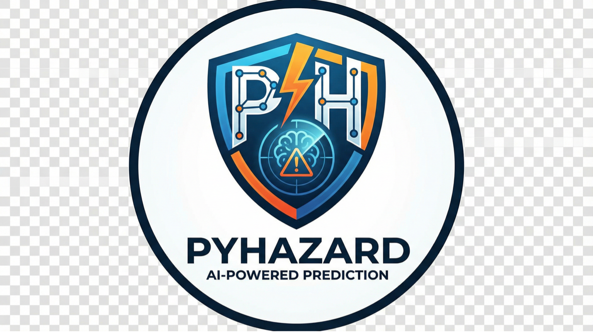

<p align="center">
  
</p>

<p align="center">
  <strong>PyHazards: A unified research framework for AI-based natural hazard forecasting, benchmarking, and model development across wildfire, earthquake, flood, and tropical cyclone tasks.</strong>
</p>

<p align="center">
  <a href="https://github.com/LabRAI/PyHazards">
    
  </a>
  <a href="https://github.com/LabRAI/PyHazards/stargazers">
    
  </a>
  <a href="https://github.com/LabRAI/PyHazards/network/members">
    
  </a>
  <a href="https://pypi.org/project/pyhazards">
    
  </a>
  <a href="https://pypi.org/project/pyhazards">
    
  </a>
</p>

<p align="center">
  <a href="https://pypi.org/project/pyhazards">
    
  </a>
  <a href="https://github.com/LabRAI/PyHazards/actions/workflows/ci.yml">
    
  </a>
  <a href="https://github.com/LabRAI/PyHazards/blob/main/LICENSE">
    
  </a>
  <a href="https://rai-lab-workspace.slack.com/archives/C0AKAJCTY4F">
    
  </a>
</p>

## Start Here

| Install | Run a first example | Browse docs |
| --- | --- | --- |
| [Installation](#installation) | [Quick Start](#quick-start) | [Documentation](#documentation) |

## Table of Contents

- [Overview](#overview)
- [Why PyHazards](#why-pyhazards)
- [Hazard Coverage](#hazard-coverage)
- [Installation](#installation)
- [Quick Start](#quick-start)
- [Project Structure](#project-structure)
- [Supported Workflows](#supported-workflows)
- [Documentation](#documentation)
- [Contributing](#contributing)
- [Community](#community)
- [Citation](#citation)
- [License](#license)

## Overview

PyHazards is built for hazard-AI work that needs more than a single model or
paper reproduction. It unifies dataset discovery, model construction,
benchmark-aligned evaluation, and experiment plumbing so the same library can
support first-run baselines, comparative studies, and contributor extensions.

Intended users:

- **Researchers**: run benchmark-aligned experiments and compare baselines across hazard tasks.
- **Practitioners**: reuse hazard-specific workflows for data inspection, model building, and evaluation.
- **Contributors**: extend datasets, models, and benchmarks through registry and catalog patterns already used in the repo.

## Why PyHazards

- **Unified datasets**: public hazard datasets, forcing sources, and inspection entrypoints live in one curated catalog.
- **Benchmark-aligned evaluation**: shared benchmark families, smoke configs, and reports keep experiments comparable.
- **Registry-based models**: published baselines and adapters are built through a consistent model-registry surface.
- **Shared training and inference pipelines**: one engine layer supports fit, evaluate, predict, and benchmark execution workflows.

## Hazard Coverage

- **Wildfire**: danger forecasting, weekly forecasting, spread baselines, fuels, burn products, and active-fire sources.
- **Earthquake**: waveform picking, dense-grid forecasting adapters, and linked benchmark ecosystems for picking and forecasting.
- **Flood**: streamflow and inundation baselines with benchmark-backed evaluation paths.
- **Tropical Cyclone**: track-and-intensity forecasting baselines plus shared benchmark ecosystems and adapters.

## Installation

Install PyHazards from PyPI:

```bash
pip install pyhazards
```

If you need GPU execution, install a compatible PyTorch build first and then
select the device as needed:

```bash
export PYHAZARDS_DEVICE=cuda:0
```

## Quick Start

Use this as the shortest benchmark-aware starter path: verify the package,
build one registered model, and run one smoke benchmark config.

1. Verify the installation:

```bash
python -c "import pyhazards; print(pyhazards.__version__)"
```

2. Build a registered model:

```python
from pyhazards.models import build_model

model = build_model(
    name="hydrographnet",
    task="regression",
    node_in_dim=2,
    edge_in_dim=3,
    out_dim=1,
)
print(type(model).__name__)
```

3. Run a benchmark-aligned smoke configuration:

```bash
python scripts/run_benchmark.py --config pyhazards/configs/flood/hydrographnet_smoke.yaml
```

4. Continue with the full docs for dataset inspection, benchmark pages, and
training workflows.

## Project Structure

- `pyhazards.datasets` - dataset catalog, registry surfaces, and inspection entrypoints.
- `pyhazards.models` - model registry, builders, and reusable baseline implementations.
- `pyhazards.benchmarks` - benchmark families, ecosystem mappings, and evaluation contracts.
- `pyhazards.engine` - shared training, inference, runner, and experiment utilities.
- `pyhazards.configs` - smoke and example benchmark configurations.
- `docs/` and `docs/source/` - published documentation, generated catalogs, and contributor guides.

## Supported Workflows

- inspect hazard datasets and forcing sources before training,
- build baseline and adapter models through the unified registry,
- run smoke tests and benchmark configs for hazard-specific tasks,
- export benchmark reports and compare metrics across models,
- extend the library with new datasets, models, benchmarks, and catalog entries.

## Documentation

Full documentation: [https://labrai.github.io/PyHazards](https://labrai.github.io/PyHazards)

Recommended reading order:

1. [Installation](https://labrai.github.io/PyHazards/installation.html)
2. [Quick Start](https://labrai.github.io/PyHazards/quick_start.html)
3. [Datasets](https://labrai.github.io/PyHazards/pyhazards_datasets.html)
4. [Models](https://labrai.github.io/PyHazards/pyhazards_models.html)
5. [Benchmarks](https://labrai.github.io/PyHazards/pyhazards_benchmarks.html)
6. [Implementation Guide](https://labrai.github.io/PyHazards/implementation.html)

## Contributing

If you want to extend PyHazards:

- **Contributing guide**: [.github/CONTRIBUTING.md](.github/CONTRIBUTING.md)
- **Developer implementation guide**: [docs/source/implementation.rst](docs/source/implementation.rst)
- **Maintainer notes**: [.github/IMPLEMENTATION.md](.github/IMPLEMENTATION.md)

Roadmap themes:

- more benchmark ecosystems and external data adapters,
- more hazard-specific baselines and evaluation coverage,
- expanded reproducibility, report tooling, and smoke-test coverage,
- stronger examples, tutorials, and contributor automation.

## Community

- **Slack**: [RAI Lab Slack Channel](https://rai-lab-workspace.slack.com/archives/C0AKAJCTY4F)

Project activity:

[](https://www.star-history.com/#LabRAI/PyHazards&Date)

## Citation

If you use PyHazards in your research, please cite:

```bibtex
@misc{pyhazards2025,
  title        = {PyHazards: An Open-Source Library for AI-Powered Hazard Prediction},
  author       = {Cheng et al.},
  year         = {2025},
  howpublished = {\url{https://github.com/LabRAI/PyHazards}},
  note         = {GitHub repository}
}
```

## License

[MIT License](LICENSE)
